# 🔬 AgenticRAG - 재료과학 연구 AI 에이전트

> **학습 목적**: 이 프로젝트는 AI 에이전트, RAG(Retrieval-Augmented Generation), ReAct, Tool Calling 등 최신 LLM 기술을 학습하기 위한 교육용 프로젝트입니다.

[](https://www.python.org/downloads/)
[](https://python.langchain.com/)
[](https://opensource.org/licenses/MIT)

---

## 📚 목차

1. [프로젝트 소개](#-프로젝트-소개)
2. [기존 코드와의 차이점](#-기존-코드와의-차이점)
3. [주요 학습 개념](#-주요-학습-개념)
4. [시스템 아키텍처](#-시스템-아키텍처)
5. [프로젝트 구조](#-프로젝트-구조)
6. [설치 방법](#-설치-방법)
7. [API 키 발급 방법](#-api-키-발급-방법)
8. [사용 방법](#-사용-방법)
9. [코드 상세 설명](#-코드-상세-설명)
10. [문제 해결](#-문제-해결)
11. [참고 자료](#-참고-자료)

---

## 🎯 프로젝트 소개

### 무엇을 하는 프로젝트인가요?

**AgenticRAG**는 반도체 인터커넥트 재료(구리, 마그네슘 합금 등)에 관한 연구 논문을 분석하고, 사용자의 질문에 지능적으로 답변하는 AI 시스템입니다.

#### 핵심 기능
1. **논문 분석**: PDF 논문에서 재료의 구성(Composition), 제조공정(Process), 물성(Property)을 자동 추출
2. **지능형 검색**: 사용자 질문에 따라 적절한 도구를 자동 선택
3. **다중 데이터 소스**: 논문 DB + 계산 데이터베이스 + 최신 논문 검색 + 웹 정보 검색

#### 실제 사용 예시

```mermaid
stateDiagram-v2
    [*] --> Query: 사용자 질문<br/>"Cu-Mg 합금의<br/>저항률과 최신 연구는?"
    
    Query --> Think1: Thought 1
    
    state Think1 {
        [*] --> Analysis: 실험 데이터 + 최신 논문<br/>두 가지 필요
        Analysis --> Decision: vectordb_search 사용
    }
    
    Think1 --> Action1: Action 1
    
    state Action1 {
        [*] --> Tool: vectordb_search
        Tool --> Input: "Cu-Mg alloy resistivity"
    }
    
    Action1 --> Obs1: Observation 1
    
    state Obs1 {
        [*] --> Result: 2.0 μΩ·cm (350℃)<br/>DC sputtering 공정
    }
    
    Obs1 --> Think2: Thought 2
    
    state Think2 {
        [*] --> Check: 최신 연구도 필요
        Check --> Decision2: crossref_search 사용
    }
    
    Think2 --> Action2: Action 2
    
    state Action2 {
        [*] --> Tool2: crossref_search
        Tool2 --> Input2: "Cu-Mg alloy 2024"
    }
    
    Action2 --> Obs2: Observation 2
    
    state Obs2 {
        [*] --> Papers: 5개 논문 발견<br/>Kim et al. (2024)
    }
    
    Obs2 --> Think3: Thought 3
    
    state Think3 {
        [*] --> Eval: 충분한 정보 확보
        Eval --> Ready: 답변 준비
    }
    
    Think3 --> Answer: Final Answer
    
    state Answer {
        [*] --> Response: Cu-Mg 합금 저항률 2.0 μΩ·cm<br/>2024년 최신 연구 5편 포함<br/>상세 분석 제공
    }
    
    Answer --> [*]
```

---

## 🔄 기존 코드와의 차이점

### 기존 코드

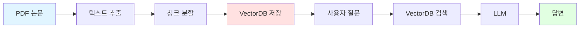

**특징 및 한계:**
- ⚠️ **단일 파일**: 모든 코드가 하나의 Jupyter Notebook 파일에 집중
- ⚠️ **단순 RAG**: VectorDB에서만 검색 (단일 데이터 소스)
- ⚠️ **수동 선택**: 사용자가 직접 검색 방법 결정
- ⚠️ **배치 처리 중심**: 모든 문서를 한 번에 처리하고 시각화
- ⚠️ **재사용 어려움**: 함수/모듈 분리 안됨

### 새로운 코드 (AgenticRAG)

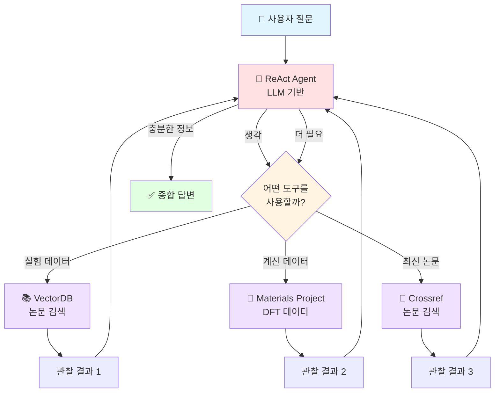

**주요 개선 사항:**

| 항목 | 기존 코드 | 새로운 코드 (AgenticRAG) |
|------|----------|------------------------|
| **구조** | 단일 파일 (1개) | 모듈화 (10개 파일) |
| **데이터 소스** | VectorDB만 | VectorDB + Materials Project + Crossref |
| **의사결정** | 사용자가 결정 | AI가 자동 결정 (Agentic) |
| **프레임워크** | 없음 | ReAct (Reasoning + Acting) |
| **도구 사용** | 수동 호출 | Tool Calling (자동) |
| **UI** | CLI만 | CLI + Streamlit 웹 |
| **설정 관리** | 하드코딩 | config.py + .env |
| **확장성** | 낮음 | 높음 (도구 추가 쉬움) |

**코드 비교:**

```python
# 기존 코드 (단순 RAG)
def answer_question(question):
    # VectorDB에서만 검색
    docs = vectordb.search(question)
    
    # LLM에게 전달
    prompt = f"Context: {docs}\nQuestion: {question}"
    answer = llm(prompt)
    
    return answer

# 새로운 코드 (AgenticRAG)
def answer_question(question):
    # Agent가 자동으로:
    # 1. 질문 분석
    # 2. 필요한 도구 선택 (vectordb/MP/crossref)
    # 3. 여러 도구를 순차적으로 사용
    # 4. 결과 종합
    
    result = agent.invoke({"input": question})
    return result["output"]
```

---

## 💡 주요 학습 개념

### 1. RAG (Retrieval-Augmented Generation)

#### 개념 설명
**RAG**는 "검색 증강 생성"이라는 의미로, LLM의 지식 부족 문제를 외부 문서 검색으로 보완하는 기술입니다.

#### 왜 필요한가?

**문제점:**
```python
# LLM만 사용한 경우
질문: "2024년에 발표된 Cu-Mg 합금의 저항률은?"
LLM: "죄송하지만 2024년 데이터는 학습하지 않았습니다." ❌
```

**해결책 (RAG):**
```python
# RAG 적용
질문: "2024년에 발표된 Cu-Mg 합금의 저항률은?"

1. 검색 (Retrieval): VectorDB에서 관련 논문 검색
   → 논문 발견: "2024년 Kim et al."
   
2. 증강 (Augmented): 검색 결과를 LLM에게 제공
   Context: [논문 내용]
   Question: [질문]
   
3. 생성 (Generation): LLM이 답변 생성
   → "2024년 Kim et al. 논문에 따르면 2.0 μΩ·cm입니다." ✅
```

#### 작동 원리

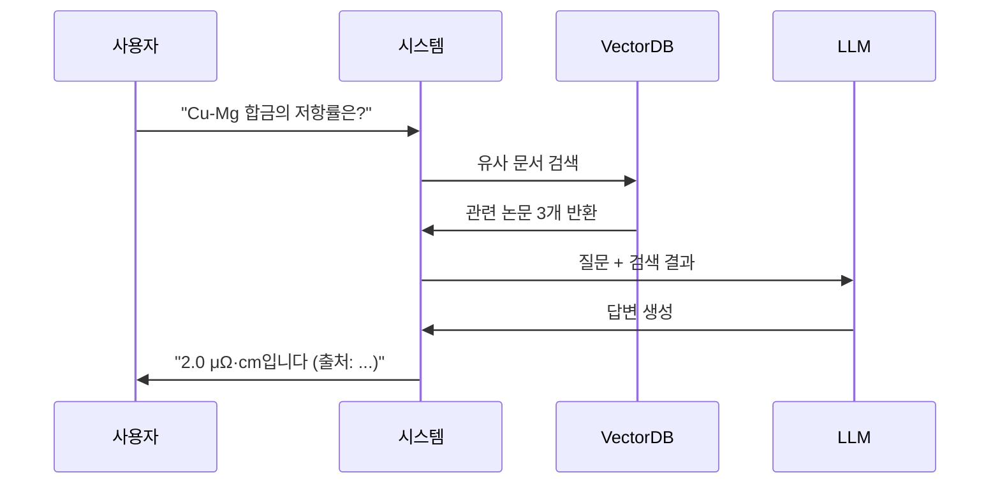

#### 참고 자료
- 📄 논문: ["Retrieval-Augmented Generation for Knowledge-Intensive NLP Tasks"](https://arxiv.org/abs/2005.11401) (Lewis et al., 2020)
- 🔗 [LangChain RAG Tutorial](https://python.langchain.com/docs/use_cases/question_answering/)

---

### 2. Agentic AI (에이전트 AI)

#### 개념 설명
**Agent**(에이전트)는 스스로 생각하고(Reasoning), 도구를 선택하고(Tool Selection), 행동하는(Acting) AI 시스템입니다.

#### 일반 AI vs Agentic AI

```python
# 일반 AI (수동)
답변 = LLM("Cu-Mg 합금의 저항률은?")
# 사람이 직접 도구 선택해야 함

# Agentic AI (자동)
답변 = Agent("Cu-Mg 합금의 저항률은?")
# Agent가 스스로:
# 1. "이건 실험 데이터 질문이네"
# 2. "VectorDB 검색해야겠다"
# 3. [도구 실행]
# 4. "충분한가? 더 필요한가?"
# 5. 최종 답변
```

#### Agent의 핵심 능력

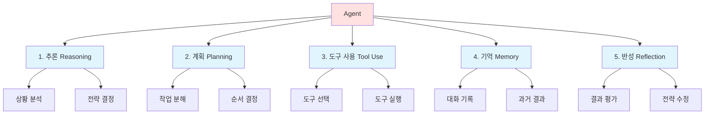

#### 실제 예시

```
사용자: "Cu2O의 밴드갭과 이를 연구한 최신 논문을 찾아줘"

=== Agent의 사고 과정 ===

[분석] 두 가지 정보 필요:
        1. 밴드갭 (계산 데이터)
        2. 최신 논문 (문헌 검색)

[계획] Step 1: Materials Project에서 밴드갭 조회
       Step 2: Crossref에서 최신 논문 검색
       Step 3: 결과 종합

[실행]
Step 1:
  Action: materials_project
  Input: Cu2O
  Result: 밴드갭 = 2.1 eV ✓

Step 2:
  Action: crossref_search
  Input: Cu2O optical properties 2024
  Result: 논문 5개 발견 ✓

[종합]
  "Cu2O의 밴드갭은 2.1 eV이며,
   2024년 최신 연구로는..."
```

#### 참고 자료
- 📄 논문: ["ReAct: Synergizing Reasoning and Acting in Language Models"](https://arxiv.org/abs/2210.03629) (Yao et al., 2023)
- 🔗 [LangChain Agents](https://python.langchain.com/docs/modules/agents/)
- 🔗 [AutoGPT](https://github.com/Significant-Gravitas/AutoGPT) - 유명한 Agent 예시

---

### 3. ReAct Framework (Reasoning + Acting)

#### 개념 설명
**ReAct**는 "추론(Reasoning)"과 "행동(Acting)"을 결합한 프레임워크로, LLM이 단계별로 생각하면서 도구를 사용하도록 만드는 방법입니다.

#### 기존 방식의 문제

```python
# Chain-of-Thought (CoT)만 사용
질문: "Cu-Mg 합금에 대해 알려줘"
LLM: [생각만 하고 도구 사용 안함]
     "Cu-Mg 합금은... [학습 데이터 기반 추측]"
     → 부정확하거나 오래된 정보 ❌

# Action만 사용
질문: "Cu-Mg 합금에 대해 알려줘"
LLM: [생각 없이 도구만 사용]
     Action: vectordb_search
     Input: "Cu-Mg"
     → 너무 광범위한 검색 ❌
```

#### ReAct: 생각 + 행동

```python
질문: "Cu-Mg 합금에 대해 알려줘"

Thought: "Cu-Mg 합금" = 실험 데이터
         → VectorDB 검색 필요
Action: vectordb_search
Input: Cu-Mg alloy properties
Observation: [저항률 데이터 발견]

Thought: 이론적 배경도 있으면 좋겠다
         → Materials Project 조회
Action: materials_project
Input: CuMg
Observation: [결정구조 데이터 발견]

Thought: 충분한 정보 확보
Final Answer: [종합 답변] ✅
```

#### ReAct 구조

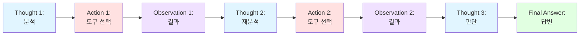

#### 코드 구현

```python
# prompts.py에서
REACT_SYSTEM_PROMPT = """
=== FORMAT ===
Thought: [현재 상황 분석 + 다음 행동 계획]
Action: [사용할 도구 이름]
Action Input: [도구에 전달할 입력]
Observation: [도구 실행 결과]
... (필요시 반복)
Final Answer: [최종 답변]

=== EXAMPLE ===
Thought: 저항률 데이터는 실험 결과이므로 논문 검색 필요
Action: vectordb_search
Action Input: Cu-Mg alloy resistivity
Observation: 2.0 μΩ·cm at 350℃
Thought: 충분한 데이터 확보
Final Answer: Cu-Mg 합금의 저항률은 2.0 μΩ·cm입니다.
"""
```

#### 참고 자료
- 📄 논문: ["ReAct: Synergizing Reasoning and Acting in Language Models"](https://arxiv.org/abs/2210.03629)
- 🔗 [ReAct 공식 페이지](https://react-lm.github.io/)
- 🔗 [LangChain ReAct 구현](https://python.langchain.com/docs/modules/agents/agent_types/react)

---

### 4. Chain-of-Thought (CoT)

#### 개념 설명
**CoT**는 LLM이 최종 답변을 내기 전에 중간 추론 단계를 거치도록 하는 프롬프팅 기법입니다.

#### 비교

```python
# CoT 없음 (Zero-shot)
질문: "23 * 47은?"
LLM: "1081입니다" ❌ (틀림)

# CoT 적용 (Few-shot)
질문: "23 * 47은?"
LLM: """
단계 1: 20 * 47 = 940
단계 2: 3 * 47 = 141
단계 3: 940 + 141 = 1081
답: 1081
""" ✅ (정확)
```

#### 프롬프트 예시

```python
# Few-shot CoT
PROMPT = """
예시 1:
질문: Cu-Mg 합금의 저항률은?
생각: 저항률은 실험으로 측정하는 물성이다.
      논문에서 찾아봐야겠다.
답변: 논문에 따르면 2.0 μΩ·cm입니다.

예시 2:
질문: Cu2O의 밴드갭은?
생각: 밴드갭은 DFT 계산으로 알 수 있다.
      Materials Project를 확인해야겠다.
답변: 계산 결과 2.1 eV입니다.

이제 당신 차례:
질문: {user_question}
생각:
"""
```

#### 참고 자료
- 📄 논문: ["Chain-of-Thought Prompting Elicits Reasoning in Large Language Models"](https://arxiv.org/abs/2201.11903) (Wei et al., 2022)

---

### 5. Tool Calling (도구 호출)

#### 개념 설명
**Tool Calling**은 LLM이 미리 정의된 함수나 API를 호출할 수 있도록 하는 기능입니다. 최신 모델들은 단순히 함수를 호출하는 것을 넘어, 원하는 데이터 구조(예: JSON)를 생성하도록 요청할 수 있습니다.

#### 작동 원리 (JSON 출력 활용)

이 프로젝트에서는 LLM이 단순히 텍스트를 반환하는 대신, 우리가 정의한 `CPPData`라는 데이터 구조에 맞춰 **JSON 형식으로 출력하도록** 요청합니다. 이는 LLM의 출력을 더 안정적이고 예측 가능하게 만듭니다.

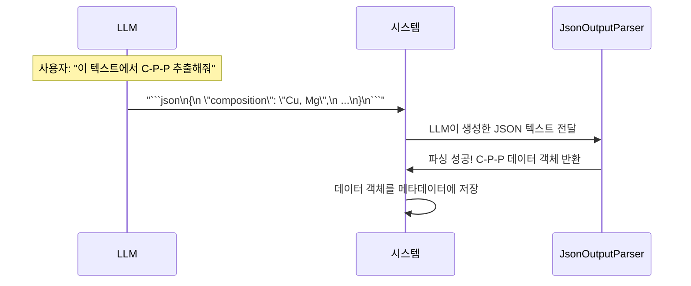

#### 구현 예시 (`JsonOutputParser` 활용)

```python
# 1. 원하는 데이터 구조 정의 (prompts.py)
from langchain_core.pydantic_v1 import BaseModel, Field

class CPPData(BaseModel):
    """C-P-P 데이터 구조"""
    composition: str = Field(description="합금의 구성 요소")
    process: str = Field(description="제조 및 실험 공정")
    property: str = Field(description="주요 특성")

# 2. JSON 파서 생성 (prompts.py)
from langchain.output_parsers import JsonOutputParser
json_parser = JsonOutputParser(pydantic_object=CPPData)

# 3. 프롬프트에 JSON 형식 포함 (prompts.py)
from langchain_core.prompts import PromptTemplate

CPP_EXTRACTION_PROMPT = PromptTemplate(
    template="""...
분석할 텍스트:
{text}

JSON 출력 형식:
{format_instructions}
""",
    input_variables=["text"],
    # 파서가 LLM에게 JSON 형식을 알려줌
    partial_variables={"format_instructions": json_parser.get_format_instructions()},
)

# 4. LLM과 연결하여 체인 생성 (vectordb.py)
extraction_chain = CPP_EXTRACTION_PROMPT | llm | json_parser

# 5. 체인 실행
# LLM이 JSON 텍스트를 생성하면, json_parser가 자동으로 파싱하여
# 우리가 정의한 CPPData 객체로 변환해줍니다.
cpp_object = extraction_chain.invoke({"text": "..."})
```

**이점:**
- **안정성**: 정해진 JSON 형식으로 결과를 받으므로, 후속 처리(예: DB 저장)가 매우 쉬워집니다.
- **정확성**: LLM이 어떤 정보를 추출해야 하는지 명확하게 이해하게 됩니다.
- **오류 처리**: 만약 LLM이 유효하지 않은 JSON을 생성하면, 파서가 오류를 발생시켜 문제를 즉시 인지할 수 있습니다.

#### 참고 자료
- 🔗 [LangChain Tools](https://python.langchain.com/docs/modules/agents/tools/)
- 🔗 [OpenAI Function Calling](https://platform.openai.com/docs/guides/function-calling)

---

### 6. Vector Database (벡터 데이터베이스)

#### 개념 설명
**Vector Database**는 텍스트를 수치 벡터로 변환하여 저장하고, 의미적 유사도로 검색하는 데이터베이스입니다.

#### 일반 검색 vs 벡터 검색

```python
# 일반 키워드 검색 (Exact Match)
검색어: "Cu alloy"
결과: "Cu alloy"를 포함한 문서만
      "copper alloy" → 검색 안됨 ❌
      "구리 합금" → 검색 안됨 ❌

# 벡터 검색 (Semantic Search)
검색어: "Cu alloy"
1. 벡터로 변환: [0.2, 0.8, -0.3, ...]
2. 유사 벡터 찾기:
   "copper alloy" → [0.21, 0.79, -0.31, ...] ✅ 유사!
   "구리 합금" → [0.19, 0.81, -0.29, ...] ✅ 유사!
```

#### 작동 원리

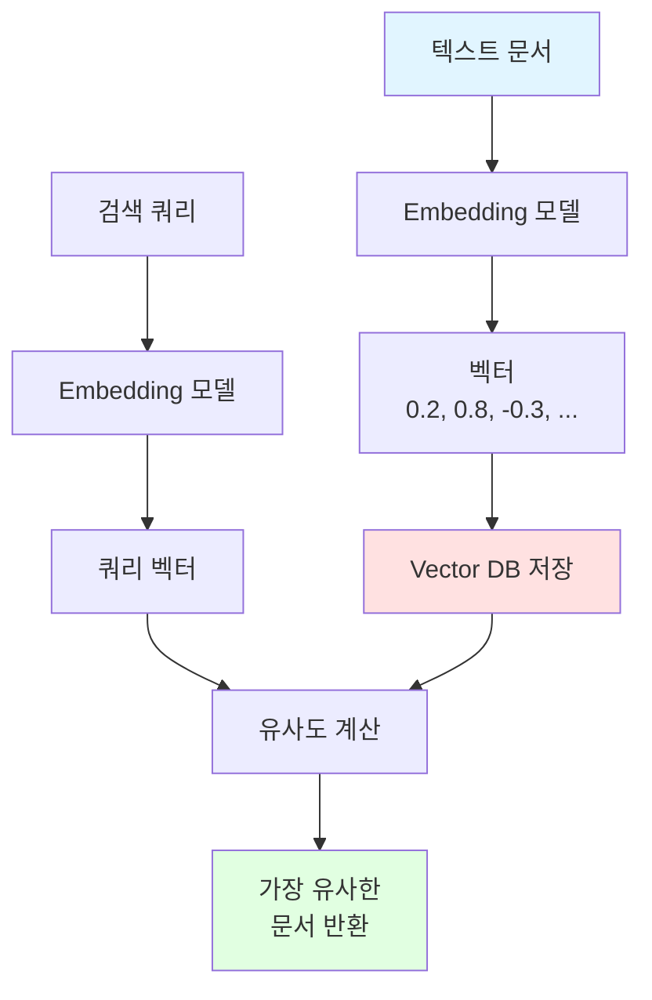

#### 수학적 원리

```python
# 1. 텍스트 → 벡터 (Embedding)
text1 = "Cu-Mg alloy"
vector1 = [0.2, 0.8, 0.1, ...]  # 300차원

text2 = "copper magnesium alloy"
vector2 = [0.21, 0.79, 0.11, ...]

# 2. 유사도 계산 (코사인 유사도)
similarity = cosine_similarity(vector1, vector2)
# = 0.98 (매우 유사!)

# 3. 검색
query = "Cu alloy"
query_vector = [0.19, 0.81, 0.09, ...]

# 모든 문서와 유사도 계산
results = db.search_by_vector(query_vector, top_k=5)
```

#### 참고 자료
- 🔗 [Chroma 공식 문서](https://docs.trychroma.com/)
- 🔗 [Pinecone Learning Center](https://www.pinecone.io/learn/vector-database/)

---

### 7. Embedding (임베딩)

#### 개념 설명
**Embedding**은 텍스트를 고차원 벡터(숫자 배열)로 변환하는 기술입니다.

#### 왜 필요한가?

```
컴퓨터는 텍스트를 이해 못함 → 숫자로 변환 필요

"Cu-Mg alloy" → 컴퓨터가 이해 못함 ❌
[0.2, 0.8, -0.3, ...] → 계산 가능 ✅
```

#### 시각적 이해

```
2D 공간에 단어 배치 (실제는 300차원+)

         copper (0.8, 0.9)
            ↑
            |
    Cu (0.7, 0.85) ← 가까움!
            |
            ↓
         gold (0.6, 0.75)


    banana (-0.5, 0.3) ← 멀리 떨어짐
```

#### 코드 예시

```python
from sentence_transformers import SentenceTransformer

# 모델 로드
model = SentenceTransformer('google/embeddinggemma-300m')

# 텍스트 → 벡터
text1 = "Cu-Mg alloy has low resistivity"
vector1 = model.encode(text1)
# shape: (300,)  # 300개의 숫자
# [0.234, -0.567, 0.891, ..., 0.123]

# 의미가 유사하면 벡터도 유사
text2 = "Copper magnesium compound shows low resistance"
vector2 = model.encode(text2)

from scipy.spatial.distance import cosine
similarity = 1 - cosine(vector1, vector2)
print(f"유사도: {similarity:.3f}")  # 0.892 (매우 유사)
```

#### 참고 자료
- 📄 논문: ["Sentence-BERT: Sentence Embeddings using Siamese BERT-Networks"](https://arxiv.org/abs/1908.10084)
- 🔗 [Hugging Face Embeddings](https://huggingface.co/models?pipeline_tag=sentence-similarity)

---

### 8. Few-shot Learning

#### 개념 설명
**Few-shot Learning**은 LLM에게 몇 개의 예시를 보여주면 패턴을 학습하는 능력입니다.

#### Zero-shot vs Few-shot

```python
# Zero-shot (예시 없음)
prompt = """
다음 텍스트에서 composition, process, property를 추출해줘:
[논문 텍스트]
"""
# 결과: 불규칙한 형식 ❌

# Few-shot (예시 3개)
prompt = """
예시 1:
입력: Cu damascene interconnects...
출력:
  composition: Cu
  process: damascene fabrication
  property: EM lifetime

예시 2:
입력: Cu-Mg alloy DC sputtering...
출력:
  composition: Cu, Mg
  process: DC magnetron sputtering
  property: resistivity 2.0 μΩ·cm

예시 3:
입력: Co-Cr barrier layer...
출력:
  composition: Co, Cr
  process: sputtering, annealing
  property: breakdown voltage

이제 다음을 분석해줘:
입력: [논문 텍스트]
"""
# 결과: 일관된 형식 ✅
```

#### 참고 자료
- 📄 논문: ["Language Models are Few-Shot Learners"](https://arxiv.org/abs/2005.14165) (Brown et al., GPT-3 논문)

---

## 🏗️ 시스템 아키텍처

### 전체 구조도

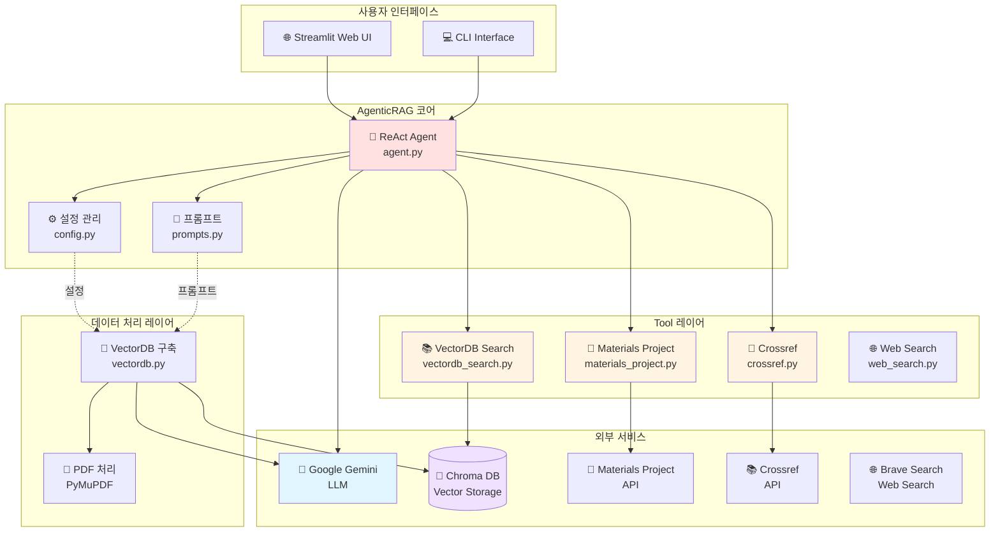

### 데이터 흐름 (Query Processing)

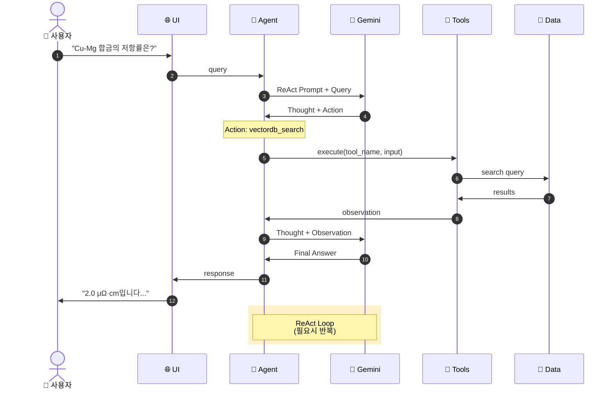

### VectorDB 구축 과정

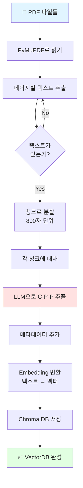

---

## 📁 프로젝트 구조

```
agentRAG/
│
├── 📄 config.py                    # ⚙️ 설정 관리
│   ├── API 키 로드 (.env)
│   ├── LLM 설정 (Gemini 모델)
│   ├── Embedding 모델 설정
│   └── 하이퍼파라미터 (청크 크기 등)
│
├── 📄 prompts.py                   # 📝 프롬프트 관리
│   ├── Few-shot 예제 (26개)
│   ├── SYSTEM_TEMPLATE (C-P-P 추출용)
│   ├── CPP_EXTRACTION_PROMPT (C-P-P 추출용)
│   └── REACT_SYSTEM_PROMPT (Agent용)
│
├── 📄 vectordb.py                  # 🗄️ VectorDB 생성
│   ├── load_pdfs() - PDF 로드
│   ├── split_documents() - 청크 분할
│   ├── extract_cpp_from_chunk() - C-P-P 추출
│   ├── create_or_load_vectordb() - DB 생성/로드
│   └── build_vectordb_pipeline() - 전체 파이프라인
│
├── 📄 agent.py                     # 🤖 ReAct Agent
│   ├── create_agent() - Agent 초기화
│   ├── run_agent() - Agent 실행
│   └── interactive_chat() - CLI 인터페이스
│
├── 📄 app.py                       # 🌐 Streamlit UI
│   ├── 웹 인터페이스
│   ├── 대화 기록 관리
│   ├── 설정 패널 (온도, verbose)
│   └── 예시 질문 버튼
│
├── 📂 tools/                       # 🔧 도구 모음
│   ├── 📄 vectordb_search.py      # 논문 검색
│   │   ├── search_vectordb()
│   │   └── vectordb_search_tool (LangChain Tool)
│   │
│   ├── 📄 materials_project.py    # DFT 데이터
│   │   ├── search_materials_project()
│   │   └── materials_project_tool
│   │
│   ├── 📄 crossref.py              # 최신 논문
│   │   ├── search_crossref()
│   │   └── crossref_tool
│   │
│   └── 📄 web_search.py            # 웹 검색
│       ├── web_search()
│       └── web_search_tool (DuckDuckGo)
│
├── 📄 .env.example                 # 🔑 환경변수 템플릿
├── 📄 .env                         # 🔑 실제 API 키 (사용자 생성)
├── 📄 requirements.txt             # 📦 필수 패키지 목록
├── 📄 README.md                    # 📖 이 문서
│
├── 📂 chroma_db/                   # 💾 VectorDB (자동 생성)
│   ├── chroma.sqlite3
│   └── [UUID 폴더들]/
│
└── 📂 data/                        # 📂 사용자 데이터
    └── pdfs/                       # PDF 파일 보관
        ├── paper1.pdf
        ├── paper2.pdf
        └── ...
```

### 각 파일의 역할 상세

#### 1. config.py - 모든 설정의 중앙 관리소

```python
"""
이 파일의 역할:
- API 키를 안전하게 관리
- 모델 설정을 한 곳에 모아서 변경 용이
- 다른 파일에서 import하여 사용
"""

# 예시
import config

# 다른 파일에서 이렇게 사용
llm = ChatGoogleGenerativeAI(
    model=config.LLM_MODEL_NAME,    # "gemini-2.5-flash"
    temperature=config.LLM_TEMPERATURE,  # 0.0
    google_api_key=config.GOOGLE_API_KEY
)
```

**주요 내용:**
- `GOOGLE_API_KEY`: Gemini API 키
- `MATERIALS_PROJECT_API_KEY`: MP API 키
- `LLM_MODEL_NAME`: 사용할 LLM 모델
- `EMBEDDING_MODEL_NAME`: 임베딩 모델
- `CHUNK_SIZE`: 텍스트 분할 크기
- `RETRIEVAL_TOP_K`: 검색 개수

#### 2. prompts.py - AI에게 주는 지시사항

```python
"""
이 파일의 역할:
- Few-shot 예제 관리
- 프롬프트 템플릿 관리
- 프롬프트 변경 시 여기만 수정
"""

# 27개의 Few-shot 예제
FEW_SHOT_EXAMPLES = [...]

# C-P-P 추출 프롬프트
SYSTEM_TEMPLATE = """..."""

# ReAct Agent 프롬프트
REACT_SYSTEM_PROMPT = """..."""
```

#### 3. vectordb.py - 논문 → 검색 가능한 DB

```python
"""
실행 방법:
    python vectordb.py

순서:
    1. PDF 로드 (PyMuPDF)
    2. 청크 분할 (800자)
    3. 각 청크에서 C-P-P 추출 (LLM)
    4. 임베딩 변환
    5. Chroma DB 저장
"""
```

#### 4-6. tools/ - Agent가 사용하는 도구들

```python
"""
각 도구의 공통 구조:

1. 실제 기능 함수
   def search_xxx(query):
       # API 호출 또는 DB 검색
       return results

2. LangChain Tool 래퍼
   xxx_tool = Tool(
       name="도구명",
       description="도구 설명",
       func=search_xxx
   )
"""
```

#### 7. agent.py - 두뇌 역할

```python
"""
실행 방법:
    python agent.py                    # 대화형 모드
    python agent.py --query "질문"     # 단일 질문
    python agent.py --verbose          # 상세 로그

핵심 로직:
    1. LLM + Tools + ReAct Prompt → Agent 생성
    2. 사용자 질문 → Agent 실행
    3. Agent가 자동으로 도구 선택 & 실행
    4. 결과 종합하여 답변
"""
```

#### 8. app.py - 웹 인터페이스

```python
"""
실행 방법:
    streamlit run app.py

기능:
    - 채팅 인터페이스
    - 대화 기록 유지
    - 설정 조절 (온도, verbose)
    - 예시 질문 버튼
"""
```

---

## 💻 설치 방법

### 사전 준비

#### 1단계: Python 설치

**Windows:**
1. [Python 공식 사이트](https://www.python.org/downloads/) 접속
2. "Download Python 3.11.x" 클릭
3. 다운로드한 설치 파일 실행
4. ⚠️ **중요**: "Add Python to PATH" 체크박스 선택!
5. "Install Now" 클릭

**확인 방법:**
```bash
# 명령 프롬프트(cmd) 또는 PowerShell 실행
python --version
# 출력: Python 3.11.x

pip --version
# 출력: pip 23.x.x
```

**Mac:**
```bash
# Homebrew로 설치
brew install python@3.11

# 확인
python3 --version
```

**Linux (Ubuntu/Debian):**
```bash
sudo apt update
sudo apt install python3.11 python3-pip

# 확인
python3 --version
```

#### 2단계: Git 설치 (선택사항)

**Windows:**
1. [Git 공식 사이트](https://git-scm.com/download/win) 접속
2. 다운로드 후 설치
3. 기본 설정으로 진행

**Mac:**
```bash
brew install git
```

**Linux:**
```bash
sudo apt install git
```

---

### 프로젝트 설치

#### 방법 1: ZIP 다운로드 (초보자 추천)

이 방법은 Git 설치가 필요 없어 가장 쉽습니다.

##### 1단계: ZIP 파일 다운로드

1. 브라우저에서 GitHub 리포지토리 페이지 접속:
   ```
   https://github.com/JDeun/SKKU_RAG
   ```

2. 페이지 상단의 **"Code"** 버튼 클릭 (초록색 버튼)

3. 드롭다운 메뉴에서 **"Download ZIP"** 선택

4. ZIP 파일이 다운로드됨 (파일명: `SKKU_RAG-main.zip`)

##### 2단계: ZIP 파일 압축 해제

**Windows:**
1. 다운로드 폴더에서 `SKKU_RAG-main.zip` 파일 찾기
2. 파일을 마우스 오른쪽 버튼으로 클릭
3. "압축 풀기..." 또는 "여기에 압축 풀기" 선택
4. 압축 해제된 폴더가 생성됨: `SKKU_RAG-main`

**Mac:**
1. 다운로드 폴더에서 ZIP 파일 더블클릭
2. 자동으로 압축 해제됨

**Linux:**
```bash
unzip SKKU_RAG-main.zip
```

##### 3단계: 프로젝트 폴더로 이동

**Windows:**
1. 파일 탐색기에서 압축 해제된 폴더 열기: `SKKU_RAG-main`
2. 주소 표시줄에 폴더 경로 복사 (예: `C:\Users\YOUR_NAME\Downloads\SKKU_RAG-main`)
3. 명령 프롬프트 실행 (Win + R → `cmd` 입력)
4. 다음 명령어 입력:
   ```cmd
   cd C:\Users\YOUR_NAME\Downloads\SKKU_RAG-main
   ```

**Mac/Linux:**
```bash
cd Downloads/SKKU_RAG-main
```

##### 4단계: 설치 확인

```bash
dir  # Windows
ls   # Mac/Linux
```

출력에 다음 파일들이 보이면 성공:
```
agent.py  app.py  config.py  prompts.py  README.md  requirements.txt  tools/  .env.example
```

#### 방법 2: Git Clone (개발자용)

Git이 설치된 경우 이 방법을 사용하세요.

```bash
git clone https://github.com/JDeun/SKKU_RAG.git
cd SKKU_RAG
```

---

### 가상환경 설정 (중요!)

#### 가상환경이란?
- Python 패키지를 프로젝트별로 분리하는 방법
- 다른 프로젝트와 충돌 방지
- **반드시 사용하세요!**

#### 가상환경 생성 및 활성화

**Windows:**
```bash
# 1. 가상환경 생성
python -m venv venv

# 2. 활성화
venv\Scripts\activate

# 3. 활성화 확인
# 프롬프트 앞에 (venv)가 표시되면 성공
(venv) C:\Users\...\agentRAG>
```

**Mac/Linux:**
```bash
# 1. 가상환경 생성
python3 -m venv venv

# 2. 활성화
source venv/bin/activate

# 3. 활성화 확인
(venv) user@computer:~/agentRAG$
```

**❗ 가상환경이 활성화되지 않으면:**
```bash
# Windows
Set-ExecutionPolicy -ExecutionPolicy RemoteSigned -Scope CurrentUser

# 다시 시도
venv\Scripts\activate
```

---

### 패키지 설치

#### 한 번에 설치 (권장)

```bash
# pip 업그레이드
python -m pip install --upgrade pip

# requirements.txt로 한 번에 설치
pip install -r requirements.txt
```

**설치 진행 과정:**
```
Collecting langchain==0.1.20
  Downloading langchain-0.1.20-py3-none-any.whl (...)
Installing collected packages: ...
Successfully installed langchain-0.1.20 ...
```

**⏱️ 예상 시간**: 5-10분 (인터넷 속도에 따라)

#### 개별 설치 (문제 발생 시)

```bash
# LangChain 관련
pip install langchain==0.1.20
pip install langchain-community==0.0.38
pip install langchain-google-genai==1.0.3

# Vector Database
pip install chromadb==0.4.24
pip install sentence-transformers==2.7.0

# PDF 처리
pip install pymupdf==1.24.2

# 기타
pip install tiktoken==0.6.0
pip install python-dotenv==1.0.1
pip install tqdm==4.66.2
pip install mp-api==0.41.2
pip install habanero==1.2.6
pip install streamlit==1.33.0
```

#### 설치 확인

```bash
# 설치된 패키지 목록
pip list

# 특정 패키지 확인
pip show langchain
```

---

### 문제 해결 (설치 단계)

#### 문제 1: "pip를 찾을 수 없습니다"

```bash
# Windows
python -m ensurepip --upgrade

# Mac/Linux
python3 -m ensurepip --upgrade
```

#### 문제 2: "권한이 거부되었습니다"

```bash
# --user 옵션 추가
pip install --user -r requirements.txt
```

#### 문제 3: "Microsoft Visual C++ 필요" (Windows)

1. [Visual C++ Redistributable](https://aka.ms/vs/17/release/vc_redist.x64.exe) 다운로드
2. 설치 후 재시도

#### 문제 4: torch 설치 오류

```bash
# CPU 버전만 설치 (가벼움)
pip install torch --index-url https://download.pytorch.org/whl/cpu
```

---

## 🔑 API 키 발급 방법

### 1. Google Gemini API (필수) ⭐

#### 왜 필요한가?
- **LLM 사용**: 텍스트 이해, 생성, C-P-P 추출 등 모든 AI 기능
- **비용**: 무료

#### 발급 단계 (스크린샷 수준 설명)

**1단계: Google AI Studio 접속**
```
브라우저에서 https://aistudio.google.com/app/apikey 접속
```

**2단계: Google 계정 로그인**
- Gmail 계정으로 로그인
- 계정이 없다면 새로 생성

**3단계: API 키 생성**
1. 페이지 상단의 "Create API Key" 버튼 클릭
2. 프로젝트 선택 또는 새 프로젝트 생성
   - "Create API key in new project" 선택 (처음이라면)
3. API 키가 생성됨 (예: `AIzaSyAbc123...`)

**4단계: API 키 복사**
```
┌─────────────────────────────────┐
│ Your API Key                    │
│ AIzaSyAbc123def456ghi789...     │
│ [📋 Copy] [👁️ Show] [🗑️ Delete]  │
└─────────────────────────────────┘
```
- 📋 Copy 버튼 클릭하여 복사
- ⚠️ **중요**: 이 키는 다시 볼 수 없으므로 안전한 곳에 보관!

**5단계: API 키 저장**
```bash
# agentRAG 폴더에서
notepad .env    # Windows
code .env       # VS Code
nano .env       # Mac/Linux

# 다음 내용 입력
GOOGLE_API_KEY=AIzaSyAbc123def456ghi789...
```

#### 사용량 확인
- [API Console](https://console.cloud.google.com/apis/dashboard)에서 확인
- 무료: 월 60회
- 유료: 1M 토큰당 $0.075 (매우 저렴)

---

### 2. Materials Project API (선택, 하지만 권장) 🔬

#### 왜 필요한가?
- **DFT 계산 데이터**: 밴드갭, 생성 에너지, 결정 구조
- **비용**: 완전 무료
- **데이터**: 150,000+ 재료

#### 발급 단계

**1단계: 계정 생성**
```
1. https://next-gen.materialsproject.org/ 접속
2. 우측 상단 "Sign Up" 클릭
3. 이메일, 비밀번호 입력
4. 이메일 인증
```

**2단계: API 키 발급**
```
1. 로그인 후 https://next-gen.materialsproject.org/api 접속
2. "Generate New API Key" 버튼 클릭
3. API 키 표시 (예: mp-abc123...)
4. 복사
```

**3단계: API 키 저장**
```bash
# .env 파일에 추가
MATERIALS_PROJECT_API_KEY=mp-abc123...
```

#### 테스트
```python
from mp_api.client import MPRester

with MPRester("mp-abc123...") as mpr:
    doc = mpr.materials.summary.get_data_by_id("mp-1234")
    print(doc.formula_pretty)
```

---

### 3. Crossref (선택) 📚

#### 왜 필요한가?
- **학술 논문 검색**: 최신 연구 동향
- **비용**: 완전 무료
- **API 키**: 불필요! (이메일만)

#### 설정 단계

```bash
# .env 파일에 추가
CROSSREF_MAILTO=your.email@example.com
```

**왜 이메일?**
- API 키 대신 이메일 제공
- 더 빠른 응답 속도
- Crossref가 문제 발생 시 연락 가능

#### 테스트
```python
from habanero import Crossref

cr = Crossref(mailto="your.email@example.com")
results = cr.works(query="copper alloy", limit=3)
print(results["message"]["items"][0]["title"])
```

---

### 4. Brave Search API (선택, 웹 검색용) 🌐

#### 왜 필요한가?
- **웹 검색**: 최신 뉴스, 트렌드, 산업 동향
- **비용**: 무료 티어 월 1000회 검색
- **장점**: DuckDuckGo보다 안정적이고 rate limit이 관대함

#### 발급 단계

**1단계: Brave Search API 접속**
```
브라우저에서 https://api.search.brave.com/ 접속
```

**2단계: 계정 생성**
- Brave Search API 계정 만들기
- 이메일 인증

**3단계: API 키 발급**
```
1. 대시보드 접속
2. "Create API Key" 버튼 클릭
3. API 키 생성 (예: `BSAxxxxxxxxxxxxxxxxxxxxxxxxxxxxx`)
4. 복사하여 안전하게 저장
```

**4단계: API 키 저장**
```bash
# .env 파일에 추가
BRAVE_API_KEY=BSAxxxxxxxxxxxxxxxxxxxxxxxxxxxxx
```

#### 테스트
```python
import requests

api_key = "BSAxxxxxxxxxxxxxxxxxxxxxxxxxxxxx"
url = "https://api.search.brave.com/res/v1/web/search"
headers = {"X-Subscription-Token": api_key}
params = {"q": "copper interconnect technology"}

response = requests.get(url, headers=headers, params=params)
print(response.json()["web"]["results"][0]["title"])
```

---

### 환경변수 파일 (.env) 최종 확인

```bash
# .env 파일 내용
GOOGLE_API_KEY=AIzaSyAbc123def456ghi789...
MATERIALS_PROJECT_API_KEY=mp-abc123def456...
CROSSREF_MAILTO=your.email@example.com
```

**확인 방법:**
```python
# Python에서 확인
python

>>> import os
>>> from dotenv import load_dotenv
>>> load_dotenv()
True
>>> os.getenv("GOOGLE_API_KEY")
'AIzaSyAbc123...'  # ✅ 출력되면 성공!
```

---

## 🚀 사용 방법

### 🎬 빠른 시작 (Quick Start)

```bash
# 1. 가상환경 활성화
venv\Scripts\activate  # Windows
source venv/bin/activate  # Mac/Linux

# 2. PDF 준비 및 VectorDB 생성 (최초 1회)
mkdir -p data/pdfs
# 논문 PDF를 data/pdfs/ 폴더에 복사
python vectordb.py  # ⚠️ 이 단계는 최초 1회만 실행

# 3. 웹 UI 실행 (VectorDB 생성 후)
streamlit run app.py

# 또는 CLI로 실행
python agent.py
```

**⚠️ 중요**: VectorDB 생성(`vectordb.py`)은 PDF를 처음 추가하거나 변경할 때만 실행하세요.

---

### 📚 Step 1: PDF 문서 준비

#### 1-1. 폴더 구조 생성

```bash
# Windows
mkdir data
cd data
mkdir pdfs
cd ..

# Mac/Linux
mkdir -p data/pdfs
```

**결과:**
```
agentRAG/
└── data/
    └── pdfs/
        (여기에 PDF 파일 넣기)
```

#### 1-2. PDF 파일 준비

**권장사항:**
- 📄 **파일 형식**: PDF만 가능
- 📝 **언어**: 영어 논문 (한국어는 추가 작업 필요)
- 🔓 **암호화**: 암호화되지 않은 파일
- 📊 **페이지 수**: 10-50페이지 권장
- 📁 **파일 수**: 처음에는 2-3개로 테스트

**예시:**
```
data/pdfs/
├── Cu_Mg_alloy_2024.pdf
├── electromigration_study.pdf
└── interconnect_materials.pdf
```

---

### 🗄️ Step 2: VectorDB 생성 (최초 1회)

> **중요**: 이 단계는 PDF를 처음 추가하거나 변경할 때만 실행합니다.
> 한 번 생성된 VectorDB는 계속 재사용됩니다.

#### 2-1. 실행

```bash
python vectordb.py
```

#### 2-2. 실행 과정

```
================================================================
VectorDB 구축 시작
================================================================

PDF 파일 또는 폴더 경로를 입력하세요: data/pdfs

📂 3개의 PDF 파일 발견
PDF 처리 중: 100%|████████████| 3/3 [00:15<00:00, 5.2s/it]
  ✓ Cu_Mg_alloy_2024.pdf: 15 페이지 로드
  ✓ electromigration_study.pdf: 20 페이지 로드
  ✓ interconnect_materials.pdf: 18 페이지 로드
✅ 총 53 페이지 로드 완료

📄 문서 분할 중 (청크 크기: 800, 오버랩: 100)...
✅ 127개 청크 생성 → 중복 제거 후 118개

🔬 C-P-P 추출 중 (총 118개 청크)...
C-P-P 추출: 100%|████████████| 24/24 [02:30<00:00, 6.3s/batch]
✅ C-P-P 추출 완료

💾 VectorDB 생성 중 (118개 청크)...
✅ VectorDB 생성 완료: chroma_db/

================================================================
VectorDB 구축 완료
================================================================
```

#### 2-3. 시간 예상

| PDF 수 | 페이지 수 | 예상 시간 |
|--------|----------|-----------|
| 1개 | 10 페이지 | 2-3분 |
| 3개 | 30 페이지 | 5-7분 |
| 5개 | 50 페이지 | 10-15분 |

**느린 단계**: C-P-P 추출 (LLM API 호출)

#### 2-4. 결과 확인

```bash
# chroma_db 폴더 생성 확인
ls chroma_db/  # Mac/Linux
dir chroma_db\  # Windows

# 출력 예시:
chroma.sqlite3
ae4f2a8b-1234-5678-9abc-def012345678/
...
```

---

### 🌐 Step 3: 웹 UI 실행

> **전제 조건**: VectorDB가 생성되어 있어야 합니다 (Step 2 완료).

#### 3-1. Streamlit 실행

```bash
streamlit run app.py
```

**❗ VectorDB가 없다면:**
```
❌ VectorDB 로드 실패: chroma_db 폴더가 없습니다.
   먼저 'python vectordb.py'를 실행하세요.
```

#### 3-2. 자동 브라우저 실행

```
  You can now view your Streamlit app in your browser.

  Local URL: http://localhost:8501
  Network URL: http://192.168.0.100:8501
```

- 브라우저가 자동으로 열림
- 안 열리면 `http://localhost:8501` 직접 접속

#### 3-3. UI 구성

```
┌────────────────────────────────────────────────────────┐
│  🔬 AgenticRAG                        [사이드바 접기]   │
│  재료과학 연구 AI 에이전트                              │
├────────────────────────────────────────────────────────┤
│                                                         │
│  💡 예시 질문                                           │
│  [Cu-Mg 합금의 저항률은?] [Cu2O의 밴드갭은?]           │
│  [electromigration 최신 논문] [Cu 합금 제조 공정]     │
│                                                         │
├────────────────────────────────────────────────────────┤
│  대화 기록                                              │
│                                                         │
│  👤 사용자: Cu-Mg 합금의 저항률은?                     │
│  🤖 AI: 논문에 따르면 2.0 μΩ·cm입니다...              │
│                                                         │
├────────────────────────────────────────────────────────┤
│  💬 질문을 입력하세요...                [전송]         │
└────────────────────────────────────────────────────────┘
```

**사이드바:**
```
┌─ 🔬 AgenticRAG ─────────────┐
│ 재료과학 연구 AI 에이전트    │
├─────────────────────────────┤
│ 📚 사용 가능한 도구          │
│ 1. VectorDB Search           │
│    논문에서 C-P-P 데이터 검색│
│ 2. Materials Project ✅      │
│    DFT 계산 데이터 조회      │
│ 3. Crossref ✅               │
│    최신 논문 검색            │
├─────────────────────────────┤
│ ⚙️ 설정                      │
│ Temperature: [====  ] 0.0    │
│ ☐ 상세 로그                  │
│ [🔄 대화 초기화]             │
├─────────────────────────────┤
│ ℹ️ 정보                      │
│ 모델: gemini-2.5-flash       │
│ 청크 크기: 800               │
│ 검색 Top-K: 10               │
└─────────────────────────────┘
```

---

### 💬 Step 4: 질문하기

#### 예시 1: 논문 검색 (VectorDB)

```
질문: "Cu-Mg 합금의 저항률은?"

🔍 Agent 사고 과정:
┌─────────────────────────────────────┐
│ Thought: 저항률 = 실험 데이터       │
│          논문 검색 필요              │
└─────────────────────────────────────┘
              ↓
┌─────────────────────────────────────┐
│ Action: vectordb_search             │
│ Input: Cu-Mg alloy resistivity      │
└─────────────────────────────────────┘
              ↓
┌─────────────────────────────────────┐
│ Observation:                        │
│ [1] paper1.pdf (p.5)                │
│ Composition: Cu, Mg                 │
│ Property: Resistivity 2.0 μΩ·cm     │
└─────────────────────────────────────┘
              ↓
┌─────────────────────────────────────┐
│ Final Answer:                       │
│ Cu-Mg 합금의 저항률은 350℃          │
│ 어닐링 후 2.0 μΩ·cm입니다.         │
│ (출처: paper1.pdf, p.5)             │
└─────────────────────────────────────┘
```

#### 예시 2: 계산 데이터 (Materials Project)

```
질문: "Cu2O의 밴드갭은?"

Thought: 밴드갭 = 계산 데이터
         Materials Project 조회
Action: materials_project
Input: Cu2O
Observation: Band Gap: 2.1 eV

Final Answer:
Materials Project의 DFT 계산에 따르면
Cu2O의 밴드갭은 2.1 eV입니다.
```

#### 예시 3: 다중 도구 사용

```
질문: "Cu-Mg 합금에 대한 최신 연구는?"

Thought 1: 기존 논문 + 최신 연구
Action 1: vectordb_search
Observation 1: [기존 논문 3개]

Thought 2: 최신 연구 확인
Action 2: crossref_search
Input: Cu-Mg alloy 2024
Observation 2: [2024년 논문 5개]

Final Answer:
VectorDB에는 Cu-Mg 합금의 저항률과...
최근 2024년 연구로는 Kim et al.의...
```

---

### 💻 Step 5: CLI 사용 (선택)

> **전제 조건**: VectorDB가 생성되어 있어야 합니다 (Step 2 완료).

#### 대화형 모드

```bash
python agent.py
```

```
============================================================
AgenticRAG 챗봇
============================================================
재료과학 연구를 위한 AI 에이전트입니다.
- VectorDB: 논문의 C-P-P 데이터 검색
- Materials Project: DFT 계산 데이터
- Crossref: 최신 논문 검색

종료하려면 'exit', 'quit', 또는 'q'를 입력하세요.
============================================================

🤖 에이전트 초기화 중...
✅ 준비 완료!

💬 질문: Cu-Mg 합금의 저항률은?

🔍 검색 중...

============================================================
📝 답변:
============================================================
Cu-Mg 합금의 저항률은 350℃ 어닐링 후 2.0 μΩ·cm입니다...

============================================================

💬 질문: 
```

#### 단일 질문 모드

```bash
# 기본
python agent.py --query "Cu2O의 밴드갭은?"

# 상세 로그 포함
python agent.py --query "Cu2O의 밴드갭은?" --verbose
```

**verbose 모드 출력:**
```
============================================================
답변:
============================================================
Cu2O의 밴드갭은 2.1 eV입니다.

============================================================
중간 단계:
============================================================

Action: materials_project
Input: Cu2O
Output: {'material_id': 'mp-361', 'band_gap': 2.137...}
```

---

## 📖 참고 자료

### 핵심 논문

1. **RAG**
   - 📄 [Retrieval-Augmented Generation for Knowledge-Intensive NLP Tasks](https://arxiv.org/abs/2005.11401)
   - Lewis et al., 2020
   - RAG의 기본 개념과 원리

2. **ReAct**
   - 📄 [ReAct: Synergizing Reasoning and Acting in Language Models](https://arxiv.org/abs/2210.03629)
   - Yao et al., 2023
   - ReAct 프레임워크의 핵심 논문

3. **Chain-of-Thought**
   - 📄 [Chain-of-Thought Prompting Elicits Reasoning in Large Language Models](https://arxiv.org/abs/2201.11903)
   - Wei et al., 2022
   - CoT의 기본 개념

4. **LangChain Agent**
   - 📄 [LangChain: Building applications with LLMs through composability](https://arxiv.org/abs/2310.01794)
   - LangChain 프레임워크

### 공식 문서

- 🔗 [LangChain Documentation](https://python.langchain.com/)
- 🔗 [LangChain Agents Guide](https://python.langchain.com/docs/modules/agents/)
- 🔗 [Chroma Documentation](https://docs.trychroma.com/)
- 🔗 [Streamlit Documentation](https://docs.streamlit.io/)
- 🔗 [Materials Project API](https://docs.materialsproject.org/)

### 유용한 GitHub 저장소

- 🔗 [LangChain GitHub](https://github.com/langchain-ai/langchain)
- 🔗 [AutoGPT](https://github.com/Significant-Gravitas/AutoGPT) - Agent 예시
- 🔗 [BabyAGI](https://github.com/yoheinakajima/babyagi) - Agent 예시

### 학습 자료

- 🎥 [RAG 설명 영상](https://www.youtube.com/watch?v=T-D1OfcDW1M)
- 🎥 [LangChain Tutorial](https://www.youtube.com/watch?v=HSZ_uaif57o)
- 📚 [Prompt Engineering Guide](https://www.promptingguide.ai/)

---

## 🐛 문제 해결

### 설치 관련

**Q1: "python을 찾을 수 없습니다"**
```bash
# PATH 확인
echo %PATH%  # Windows
echo $PATH   # Mac/Linux

# Python 재설치 (PATH 옵션 체크)
```

**Q2: "가상환경이 활성화되지 않습니다"**
```bash
# Windows - ExecutionPolicy 변경
Set-ExecutionPolicy -ExecutionPolicy RemoteSigned -Scope CurrentUser

# 다시 시도
venv\Scripts\activate
```

### API 키 관련

**Q3: "GOOGLE_API_KEY를 찾을 수 없습니다"**
```bash
# .env 파일 존재 확인
ls -la .env  # Mac/Linux
dir .env     # Windows

# 내용 확인
cat .env     # Mac/Linux
type .env    # Windows

# Python에서 확인
python -c "from dotenv import load_dotenv; import os; load_dotenv(); print(os.getenv('GOOGLE_API_KEY'))"
```

### VectorDB 관련

**Q4: "VectorDB를 로드할 수 없습니다"**
```bash
# chroma_db 폴더 확인
ls -la chroma_db/  # Mac/Linux
dir chroma_db\     # Windows

# 없다면 생성 필요
python vectordb.py
```

**원인**: VectorDB가 생성되지 않았거나 삭제됨  
**해결**: `vectordb.py`를 실행하여 VectorDB 생성

**Q5: "PDF 로드 실패"**
- 암호화된 PDF인지 확인
- 파일 경로에 한글/특수문자 없는지 확인
- PDF가 손상되지 않았는지 확인

### Agent 관련

**Q6: "Agent가 답변하지 않습니다"**
- API 키 확인
- 인터넷 연결 확인
- verbose 모드로 로그 확인:
  ```bash
  python agent.py --query "질문" --verbose
  ```

**Q7: "Agent가 잘못된 도구를 선택합니다"**
- 프롬프트 개선 (prompts.py)
- Temperature 낮추기 (0.0)
- Few-shot 예제 추가

### Streamlit 관련

**Q8: "Streamlit이 실행되지 않습니다"**
```bash
# 포트 충돌 확인
streamlit run app.py --server.port 8502

# 캐시 삭제
rm -rf ~/.streamlit/cache  # Mac/Linux
rmdir /s %USERPROFILE%\.streamlit\cache  # Windows
```

---

## 📧 문의 및 기여

### 문의
- Issue 등록
- Email: [이메일 주소]

### 기여
1. Fork
2. Feature Branch 생성
3. Commit
4. Pull Request

---

## 📄 라이선스

MIT License - 자유롭게 사용, 수정, 배포 가능

---

**마지막 업데이트**: 2025-11-13  
**제작자**: Kevin.Cho  
**버전**: 1.0.0

---

**⭐ 프로젝트가 도움이 되었다면 Star를 눌러주세요!**
