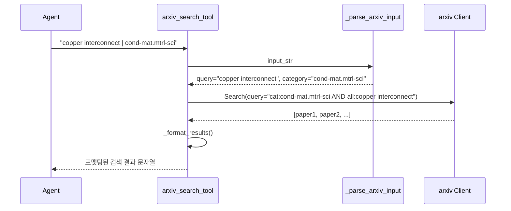
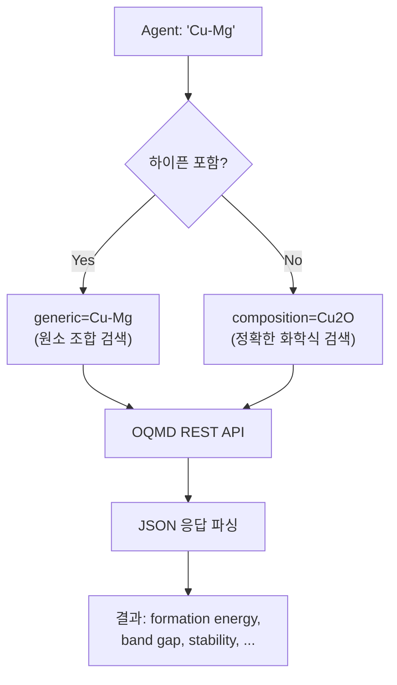
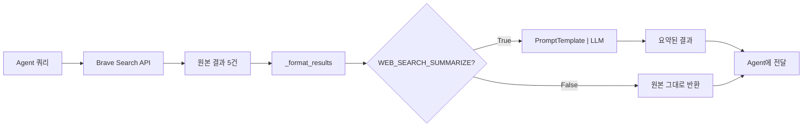
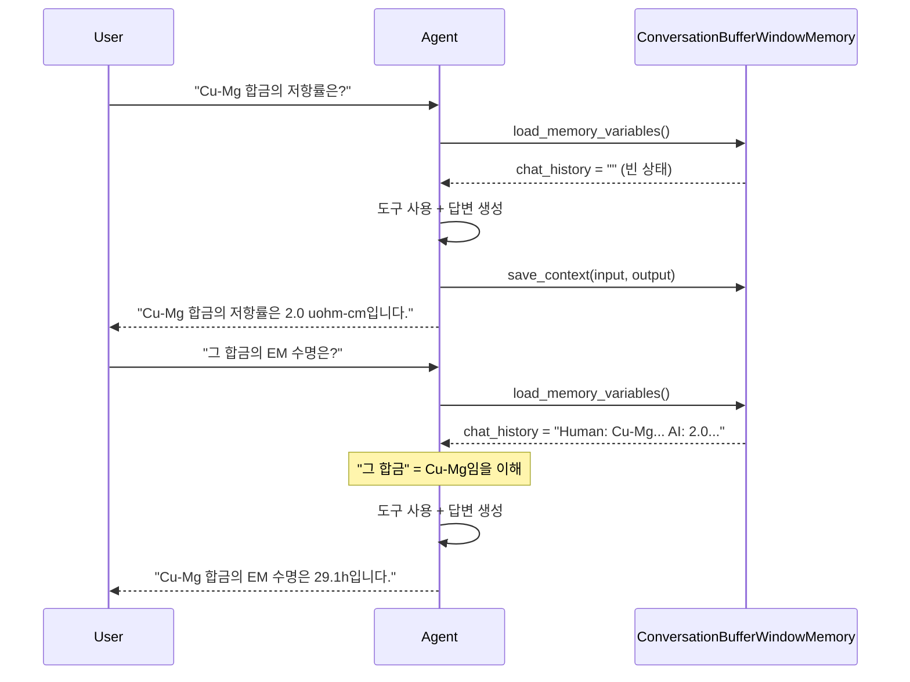

# AgenticRAG 업데이트 학습 가이드

> 원본 코드 대비 추가/수정된 5가지 주요 기능을 설명하는 학습 가이드입니다.
> 각 기능의 **왜 필요한지**, **어떻게 구현했는지**, **직접 실습하는 방법**을 다룹니다.

## 변경 파일 요약

| 변경 유형 | 파일 | 설명 |
|-----------|------|------|
| **신규** | `tools/arxiv_search.py` | arXiv 논문 검색 도구 |
| **신규** | `tools/oqmd_search.py` | OQMD DFT 데이터 검색 도구 |
| **수정** | `tools/web_search.py` | 웹검색 결과 LLM 요약 후처리 추가 |
| **수정** | `agent.py`, `prompts.py` | 멀티턴 대화 메모리 통합 |
| **수정** | `config.py`, `requirements.txt`, `vectordb.py` | 코드 품질 개선 (API 키 중앙화, 의존성 명시 등) |

---

## 1. arXiv 논문 검색 도구

### 개념 설명

기존 AgenticRAG에는 논문 검색 수단이 Crossref뿐이었습니다. Crossref는 출판된 저널 논문만 검색 가능하고, **최신 프리프린트**(아직 저널에 게재되지 않은 논문)는 찾을 수 없습니다. 재료과학 분야에서는 arXiv의 `cond-mat`(응집물질) 카테고리에 중요한 연구가 먼저 올라오는 경우가 많으므로, arXiv 검색 도구를 추가했습니다.

**핵심 포인트:**
- `arxiv` 파이썬 라이브러리 사용 (API 키 불필요)
- 카테고리 필터링으로 특정 분야 논문만 검색 가능
- LangChain `Tool` 래퍼 패턴으로 Agent에 통합

### 핵심 코드

#### 검색 함수

```python
# tools/arxiv_search.py

import arxiv

def search_arxiv(query, max_results=None, category_filter=None):
    # 카테고리 필터 적용 — arXiv 쿼리 문법 사용
    search_query = query
    if category_filter:
        search_query = f"cat:{category_filter} AND all:{query}"

    client = arxiv.Client()
    search = arxiv.Search(
        query=search_query,
        max_results=max_results,
        sort_by=arxiv.SortCriterion.Relevance  # 관련도 순 정렬
    )

    results = []
    for paper in client.results(search):
        results.append({
            "title": paper.title,
            "authors": ", ".join([a.name for a in paper.authors[:5]]),
            "abstract": paper.summary,
            "published": paper.published.strftime("%Y-%m-%d"),
            "arxiv_id": paper.entry_id.split("/")[-1],
            "pdf_url": paper.pdf_url,
            "categories": paper.categories
        })
    return results
```

**포인트:** `arxiv.Client()`는 rate limit을 자동 관리합니다. `paper.entry_id`에서 arXiv ID만 추출하기 위해 `split("/")[-1]`을 사용합니다.

#### LangChain Tool 래퍼

```python
# Agent가 "query | category" 형식으로 입력하면 파이프 기준으로 분리
def _parse_arxiv_input(input_str):
    if "|" in input_str:
        parts = input_str.split("|", 1)
        return parts[0].strip(), parts[1].strip()
    return input_str.strip(), None

arxiv_search_tool = Tool(
    name="arxiv_search",
    description="Search preprint papers from arXiv...",
    func=lambda query: _format_results(
        search_arxiv(*_parse_arxiv_input(query))
    )
)
```

**포인트:** Agent는 도구에 **문자열 하나**만 전달할 수 있으므로, 파이프(`|`)를 구분자로 사용하여 `query`와 `category_filter`를 하나의 문자열로 받습니다.

### 작동 원리



### 직접 해보기

```bash
# 1. 의존성 설치
pip install arxiv>=2.1.0

# 2. 단독 테스트 (API 키 불필요!)
cd SKKU_RAG-main
python tools/arxiv_search.py

# 3. 출력 예시:
# === arXiv 검색 결과 (5건) ===
# 1. Electromigration in Cu interconnects...
#    저자: Smith, J., ...
#    arXiv ID: 2401.12345
```

---

## 2. OQMD DFT 데이터 검색 도구

### 개념 설명

기존에는 DFT(밀도 범함수 이론) 계산 데이터를 Materials Project에서만 가져왔습니다. 하지만 Materials Project는 **API 키가 필요**하고, 데이터베이스 커버리지에 한계가 있습니다.

OQMD(Open Quantum Materials Database)는:
- **API 키 불필요** — 누구나 바로 사용 가능
- Materials Project와 **상호 보완적**인 데이터 보유
- REST API로 간단하게 호출 가능

### 핵심 코드

```python
# tools/oqmd_search.py

import requests
import config

def search_oqmd(query, limit=None):
    base_url = config.OQMD_API_BASE_URL  # "https://oqmd.org/oqmdapi"
    url = f"{base_url}/formationenergy"

    # 핵심 분기: 하이픈 유무로 검색 방식 결정
    if "-" in query:
        # "Cu-Mg" → generic 검색 (원소 조합에 해당하는 모든 화합물)
        params = {"generic": query, "limit": limit, "format": "json"}
    else:
        # "Cu2O" → composition 검색 (정확한 화학식)
        params = {"composition": query, "limit": limit, "format": "json"}

    response = requests.get(url, params=params, timeout=config.OQMD_API_TIMEOUT)
    response.raise_for_status()
    data = response.json()

    results = []
    for entry in data.get("data", [])[:limit]:
        results.append({
            "composition": entry.get("composition", "N/A"),
            "formation_energy": entry.get("delta_e", "N/A"),  # eV/atom
            "stability": entry.get("stability", "N/A"),
            "band_gap": entry.get("band_gap", "N/A"),
            "spacegroup": entry.get("spacegroup", "N/A"),
            # ...
        })
    return results
```

**포인트:**
- `generic` vs `composition` 파라미터 분기가 핵심입니다
- `"Cu-Mg"` → 원소 조합으로 가능한 **모든** 화합물 검색 (CuMg, Cu2Mg, CuMg2, ...)
- `"Cu2O"` → 해당 화학식의 **정확한** 데이터만 검색

### 작동 원리



### 직접 해보기

```bash
# 1. requests는 이미 설치되어 있을 가능성이 높음
pip install requests>=2.25.0

# 2. 단독 테스트 (API 키 불필요!)
python tools/oqmd_search.py

# 3. 브라우저에서 직접 API 호출해보기:
# https://oqmd.org/oqmdapi/formationenergy?composition=Cu2O&limit=5&format=json
```

---

## 3. 웹검색 LLM 요약 후처리

### 개념 설명

기존 웹검색 도구는 Brave Search API 결과를 **그대로** Agent에게 전달했습니다. 문제점:
- 검색 결과 snippet이 길고 노이즈가 많음
- Agent의 context window를 불필요하게 소모
- Agent가 관련 정보를 직접 골라내야 함

**해결책:** 검색 결과를 Agent에게 전달하기 전에, 별도의 LLM으로 **요약**하여 핵심만 전달합니다.

### 핵심 코드

#### 싱글톤 캐싱 패턴

```python
# tools/web_search.py

_summary_llm = None  # 모듈 레벨 전역 변수

def _get_summary_llm():
    """LLM 인스턴스를 한 번만 생성하고 재사용합니다."""
    global _summary_llm
    if _summary_llm is None:
        from langchain_google_genai import ChatGoogleGenerativeAI
        _summary_llm = ChatGoogleGenerativeAI(
            model=config.LLM_MODEL_NAME,
            temperature=0.0,
            google_api_key=config.GOOGLE_API_KEY
        )
    return _summary_llm
```

**포인트:** LLM 객체 생성은 비용이 크므로 (모델 로딩, API 연결 등), **싱글톤 패턴**으로 한 번만 생성하고 이후에는 재사용합니다.

#### LangChain 체인 패턴 (PromptTemplate | LLM)

```python
def _summarize_with_llm(formatted_results, query):
    if not config.WEB_SEARCH_SUMMARIZE:  # config에서 on/off 제어
        return formatted_results

    from langchain.prompts import PromptTemplate

    llm = _get_summary_llm()
    summary_prompt = PromptTemplate.from_template(
        "다음 웹 검색 결과를 '{query}'와 관련하여 핵심만 요약하세요.\n"
        "각 출처의 주요 정보를 간결하게 정리하고, 출처 링크를 포함하세요.\n\n"
        "{results}"
    )

    # LCEL 파이프라인: PromptTemplate → LLM
    chain = summary_prompt | llm
    result = chain.invoke({"query": query, "results": formatted_results})
    return result.content
```

**포인트:** `summary_prompt | llm`은 LangChain Expression Language(LCEL) 문법입니다. 파이프(`|`) 연산자로 프롬프트와 LLM을 체인으로 연결하면, `invoke()` 한 번으로 "프롬프트 포맷팅 → LLM 호출 → 결과 반환"이 자동으로 실행됩니다.

#### Tool에 요약 통합

```python
web_search_tool = Tool(
    name="web_search",
    func=lambda query: _summarize_with_llm(
        _format_results(web_search(query)),  # 검색 → 포맷팅
        query                                 # → LLM 요약
    )
)
```

### 작동 원리



### 직접 해보기

```python
# config.py에서 요약 기능 on/off 전환
WEB_SEARCH_SUMMARIZE = True   # LLM 요약 활성화
WEB_SEARCH_SUMMARIZE = False  # 원본 결과 그대로 전달

# 테스트: 두 모드의 출력 차이 비교
python tools/web_search.py
```

---

## 4. 멀티턴 대화 메모리

### 개념 설명

원본 Agent는 **매 질문을 독립적으로** 처리했습니다. 즉, "Cu-Mg 합금의 저항률은?" → 답변 → "그 합금의 EM 수명은?" 이라고 물으면 **"그 합금"이 뭔지 모릅니다.**

멀티턴 대화 메모리를 추가하면:
- 이전 대화 내용을 기억
- "그것", "위의", "아까 말한" 같은 대명사 참조 가능
- 후속 질문(follow-up question) 자연스럽게 처리

### 핵심 코드

#### 메모리 객체 생성 (`agent.py`)

```python
# agent.py

from langchain.memory import ConversationBufferWindowMemory

def create_agent(verbose=True, temperature=0.0):
    # ...

    # 최근 N턴만 유지하는 슬라이딩 윈도우 메모리
    memory = ConversationBufferWindowMemory(
        memory_key="chat_history",   # 프롬프트에서 참조할 변수명
        k=config.MEMORY_WINDOW_SIZE, # 최근 5턴만 유지 (config에서 설정)
        return_messages=False        # 문자열로 반환 (ReAct 호환)
    )

    agent_executor = AgentExecutor(
        agent=agent,
        tools=tools,
        memory=memory,  # 여기에 메모리 연결
        # ...
    )
    return agent_executor
```

**포인트:**
- `ConversationBufferWindowMemory`는 최근 `k`턴만 유지하므로 토큰을 절약합니다
- `memory_key="chat_history"`는 프롬프트의 `{chat_history}` 변수와 **반드시 일치**해야 합니다
- `return_messages=False`로 설정해야 ReAct 프롬프트(문자열 기반)와 호환됩니다

#### 프롬프트에 대화 히스토리 삽입 (`prompts.py`)

```python
# prompts.py — REACT_SYSTEM_PROMPT 하단

REACT_SYSTEM_PROMPT = """You are a materials science research agent...

{tools}

... (중략) ...

=== CONVERSATION HISTORY ===
{chat_history}

Question: {input}
Thought:{agent_scratchpad}
"""
```

**포인트:** `{chat_history}` 변수가 프롬프트에 있어야 LangChain이 자동으로 이전 대화를 삽입합니다. 없으면 메모리 객체가 있어도 작동하지 않습니다.

### 작동 원리



### 직접 해보기

```bash
# 대화형 모드로 실행
python agent.py

# 테스트 시나리오:
# 1. "Cu-Mg 합금의 특성을 알려줘"
# 2. "그 합금의 제조 공정은?" ← "그 합금"이 Cu-Mg으로 인식되는지 확인
# 3. "더 높은 EM 수명을 가진 합금은?" ← 문맥 유지 확인
```

```python
# config.py에서 메모리 윈도우 크기 조절
MEMORY_WINDOW_SIZE = 5   # 최근 5턴 (기본값)
MEMORY_WINDOW_SIZE = 10  # 더 많은 맥락 유지 (토큰 소모 증가)
MEMORY_WINDOW_SIZE = 1   # 직전 1턴만 기억
```

---

## 5. 코드 품질 개선

### 개념 설명

원본 코드에는 실행 환경에 따라 발생하는 여러 문제가 있었습니다. 이 섹션은 화려한 새 기능은 아니지만, **실제 프로젝트에서 매우 중요한** 엔지니어링 관행들입니다.

### 5.1 API 키 중앙화 (`config.py`)

**문제:** API 키가 각 파일에 흩어져 있으면, 키를 변경할 때 여러 파일을 수정해야 합니다.

```python
# config.py — 모든 API 키를 한 곳에서 관리

# .env 파일에서 환경변수 자동 로드
from dotenv import load_dotenv
load_dotenv()

GOOGLE_API_KEY = os.getenv("GOOGLE_API_KEY")
MATERIALS_PROJECT_API_KEY = os.getenv("MATERIALS_PROJECT_API_KEY")
BRAVE_API_KEY = os.getenv("BRAVE_API_KEY")

# 다른 파일에서는 config만 import
# tools/web_search.py
import config
api_key = config.BRAVE_API_KEY  # 직접 os.getenv() 호출하지 않음
```

### 5.2 `isatty()` 가드

**문제:** `input()` 함수가 Streamlit이나 Jupyter 같은 **비대화형 환경**에서 실행되면 에러가 발생합니다.

```python
# config.py

GOOGLE_API_KEY = os.getenv("GOOGLE_API_KEY")

# sys.stdin.isatty() → 터미널에서 실행 중인지 확인
if not GOOGLE_API_KEY and sys.stdin.isatty():
    # 터미널일 때만 사용자에게 키 입력을 요청
    GOOGLE_API_KEY = input("Google API 키를 입력하세요: ").strip()

# Streamlit/Jupyter에서는 input() 호출 없이 조용히 넘어감
```

### 5.3 의존성 명시 (`requirements.txt`)

**문제:** 새로 추가한 도구에 필요한 패키지가 `requirements.txt`에 없으면, 다른 사람이 코드를 받았을 때 `ModuleNotFoundError`가 발생합니다.

```
# requirements.txt에 추가된 항목들

# Web Search API
requests>=2.25.0

# arXiv 논문 검색
arxiv>=2.1.0
```

### 5.4 Pydantic 호환성 (`prompts.py`)

**문제:** LangChain은 내부적으로 Pydantic v1 API를 사용하지만, 최신 Pydantic v2가 설치되면 호환성 에러가 발생합니다.

```python
# prompts.py

# Pydantic v2가 설치된 경우 → v1 호환 레이어 사용
try:
    from pydantic.v1 import BaseModel, Field
except ImportError:
    # Pydantic v1이 설치된 경우 → 직접 import
    from pydantic import BaseModel, Field
```

### 5.5 로깅/경고 억제 (`config.py`)

**문제:** TensorFlow, LangChain 등의 라이브러리가 불필요한 경고 메시지를 대량으로 출력합니다.

```python
# config.py — 불필요한 로그를 카테고리별로 억제

import warnings
import logging

# 사용자에게 불필요한 경고 억제
warnings.filterwarnings("ignore", category=UserWarning, module="tensorflow")
warnings.filterwarnings("ignore", category=DeprecationWarning, module="langchain_core")

# 로거 레벨 조정
logging.getLogger('tensorflow').setLevel(logging.ERROR)
logging.getLogger('langchain').setLevel(logging.WARNING)
```

---

## 전체 아키텍처 변경 요약

### Before (원본)

```
Agent (ReAct, 메모리 없음)
├── vectordb_search     — 논문 C-P-P 데이터
├── materials_project   — DFT 계산 데이터 (API 키 필요)
├── crossref_search     — 학술 논문 검색
└── web_search          — 웹 검색 (원본 결과 그대로)
```

### After (수정 후)

```
Agent (ReAct, 멀티턴 메모리)
├── vectordb_search     — 논문 C-P-P 데이터
├── materials_project   — DFT 계산 데이터 (API 키 필요)
├── crossref_search     — 학술 논문 검색
├── web_search          — 웹 검색 + LLM 요약 후처리   ← 개선
├── arxiv_search        — arXiv 프리프린트 검색 (NEW)
└── oqmd_search         — OQMD DFT 데이터 (NEW)

+ ConversationBufferWindowMemory (최근 5턴)          ← 신규
+ config.py 중앙화 설정                               ← 개선
```

| 항목 | Before | After |
|------|--------|-------|
| 도구 수 | 4개 | **6개** (+arXiv, +OQMD) |
| API 키 필요 도구 | 4개 | 4개 (새 도구는 키 불필요) |
| 대화 메모리 | 없음 | **최근 5턴** 유지 |
| 웹검색 결과 | 원본 그대로 | **LLM 요약** |
| 설정 관리 | 파일별 분산 | **config.py 중앙화** |

---

## 챌린지 아이디어

스스로 확장해볼 수 있는 추가 과제입니다.

### 초급
1. **OQMD 검색 필터 추가**: `band_gap` 범위로 필터링하는 기능 구현
2. **arXiv 날짜 범위 검색**: 최근 1년 내 논문만 검색하도록 수정
3. **메모리 윈도우 크기 실험**: `MEMORY_WINDOW_SIZE`를 1, 5, 10으로 바꿔가며 대화 품질 비교

### 중급
4. **새로운 도구 추가**: Wikipedia API나 PubChem API를 LangChain Tool로 래핑
5. **검색 결과 캐싱**: 동일 쿼리 반복 시 API 호출 없이 캐시에서 반환 (`functools.lru_cache` 활용)
6. **ConversationSummaryMemory로 교체**: 대화 전체를 요약하는 메모리 방식으로 변경하고 차이 비교

### 고급
7. **Streamlit UI에 대화 히스토리 표시**: `st.session_state`와 메모리 연동
8. **Tool 사용 통계 수집**: 어떤 도구가 얼마나 자주 사용되는지 로깅 + 시각화
9. **멀티 에이전트 구조**: 도구 선택 전문 에이전트와 답변 생성 에이전트를 분리 (LangGraph 활용)
